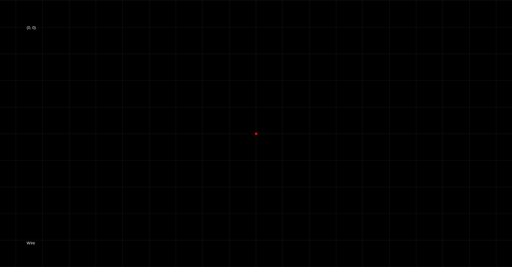
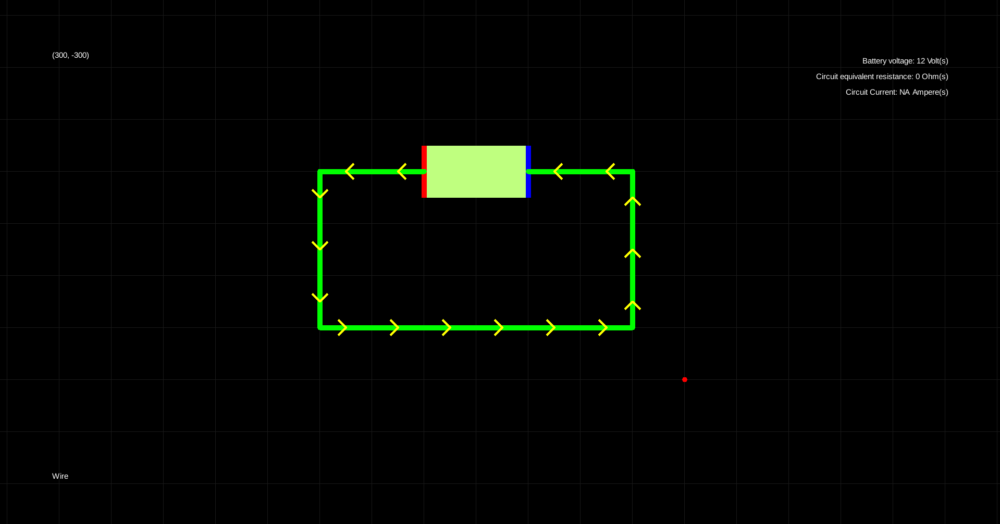
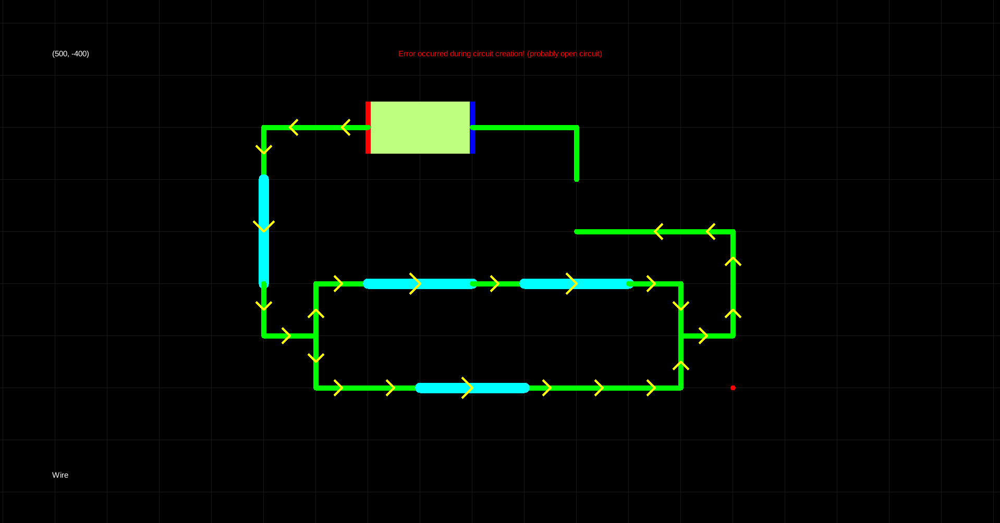
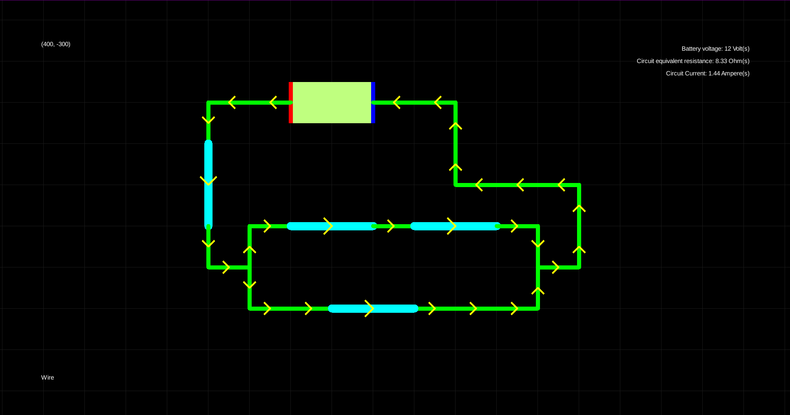
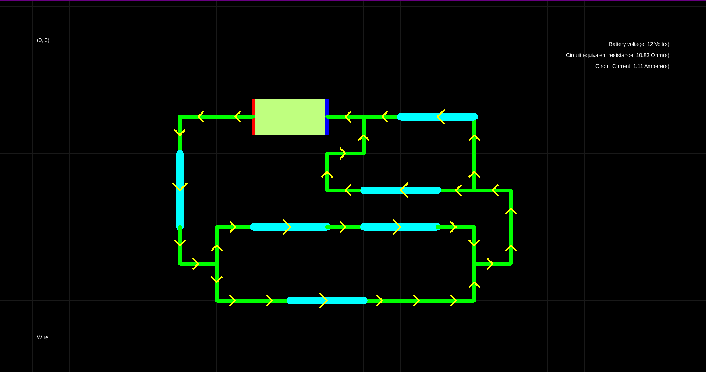
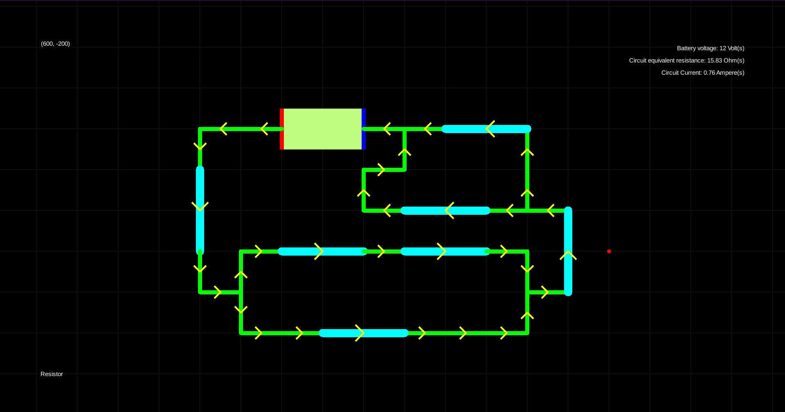
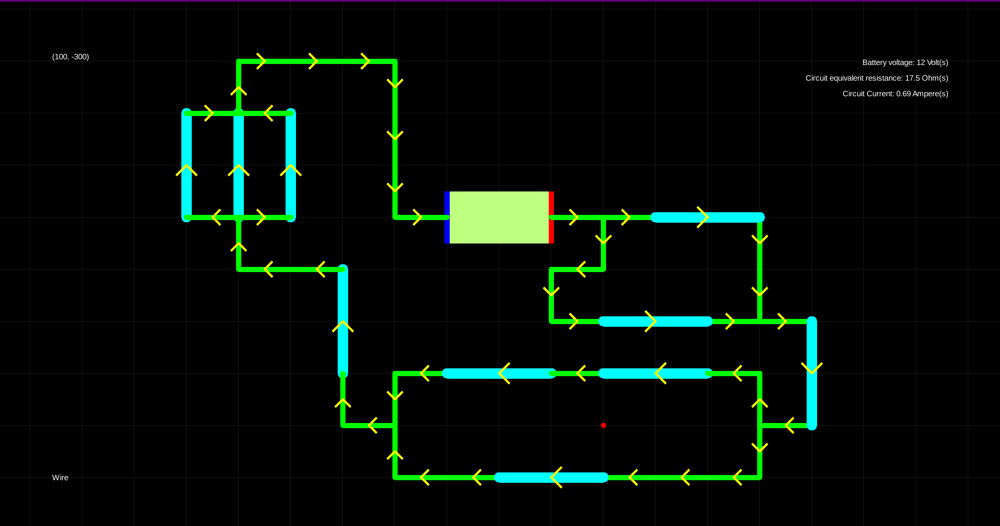

***GITHUB LINK: https://github.com/bigdubz/2024-phys2-project-circuits***

# 2024 Summer PSUT Physics 2 Project: Circuit Builder and Resistance Calculator
 
## What it can do
 - Draw pretty much any electrical circuit with wires, batteries, and resistors
 - Simulate current direction for *most* circuits
 - Calculate equivalent resistance and current for a circuit

## What it can't do
 - Calculate equivalent resistances for parallelism levels of more than one (project deadline wasn't enough)
 - Get the current direction correctly for complex circuits
## How to use
##### ***NOTE: A JDK needs to be installed in order to run .exe file!***
1. Launch `project.exe`
2. Hold and drag using the right mouse button to move the camera
3. Press `q` to switch between electrical components, the selected component can be seen in the bottom left corner
4. Press and hold `f` and mouse drag with the desired component, stop holding `f` to place component
5. Once a circuit (at least one battery and wires connecting the terminals) is correctly built, press `c` to calculate the circuit's current and equivalent resistance
6. Delete components by holding and dragging the left mouse button to select components, then press `d` to delete
7. The terminals of a battery can be flipped by selecting the battery and pressing `e`
8. To change the voltage of a battery or the resistance of a resistor, select the component and press `j` or `k` to increase/decrease respectively
9. To see the resistance of a component, select the component and press `r`

## Screenshots

